# Active Directory - Common Tasks

**Common Tasks**:
1. Reset user password
2. Add a user to a group
3. Create a user account

Open the Active Directory Users and Computers (ADUC) program to follow the instructions for each task.

## Reset user password
### 1. Find the User Account
1. Click the Search Icon.
2. Enter the user’s name or logon name to find the account.
3. Click "Find Now". 

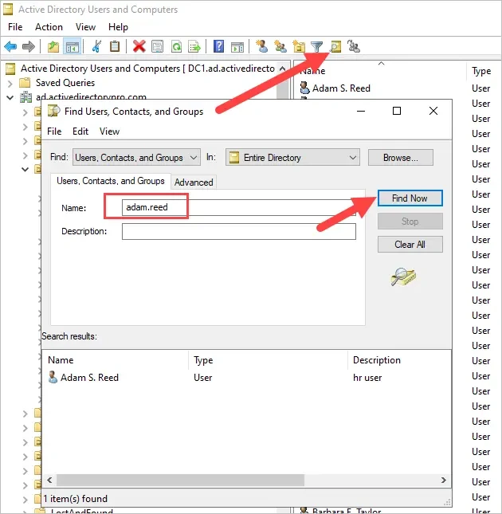
Image provided by [Active Directory Pro](https://activedirectorypro.com/wp-content/uploads/2023/08/reset-ad-password-3.webp) 

### 2. Reset Password
1. Right click the account and select “Reset Password”.
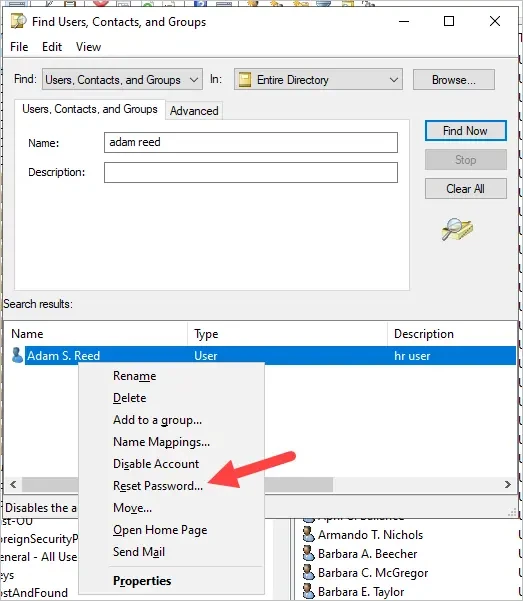
Image provided by [Active Directory Pro](https://activedirectorypro.com/wp-content/uploads/2023/08/reset-ad-password-3.webp) 

**Note**: The Reset Password box will show you if the account is locked out.
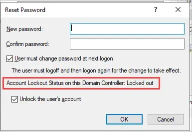
Image provided by [Active Directory Pro](https://activedirectorypro.com/wp-content/uploads/2023/08/reset-ad-password-4.webp) 

2. Enter the new password, and confirm the password.
3. If you want to require the user to change their password at the next logon 
then check the box “User must change password at next logon”.
4. Click "OK".
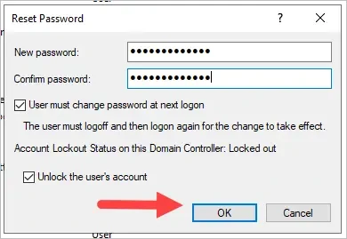
Image provided by [Active Directory Pro](https://activedirectorypro.com/wp-content/uploads/2023/08/reset-ad-password-5.webp) 
5. You will get a confirmation message.

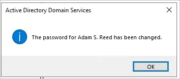
Image provided by [Active Directory Pro](https://activedirectorypro.com/wp-content/uploads/2023/08/reset-ad-password-6.webp) 

## Add a User to a Group
1. Open the user account and click on the “member of” tab.
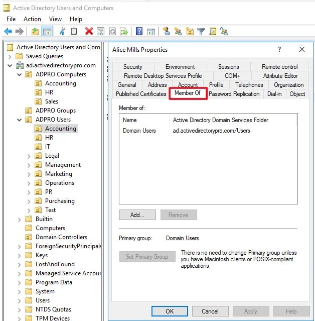
Image provided by [Active Directory Pro](https://activedirectorypro.com/wp-content/uploads/2021/01/add-user-ad-group-3.jpg) 
2. Next, click on the add button.
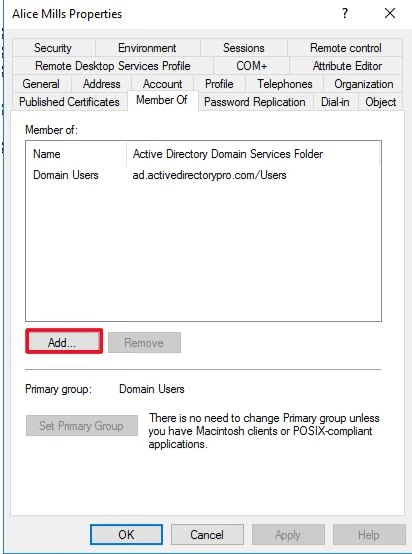
Image provided by [Active Directory Pro](https://activedirectorypro.com/wp-content/uploads/2021/01/add-user-ad-group-4.jpg) 
3. You can type the full group name or type a partial name and click check names. It will give a list of all the matching groups.
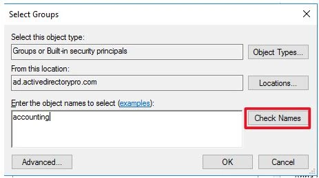
Image provided by [Active Directory Pro](https://activedirectorypro.com/wp-content/uploads/2021/01/add-user-ad-group-5.jpg) 
4. I selected the one I wanted and clicked ok.
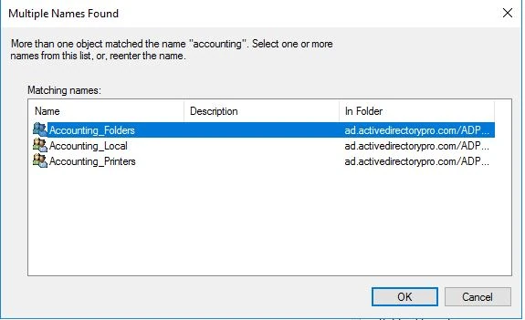
Image provided by [Active Directory Pro](https://activedirectorypro.com/wp-content/uploads/2021/01/add-user-ad-group-6.jpg) 
5. Click ok again.
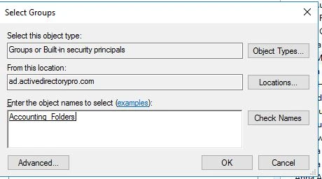
Image provided by [Active Directory Pro](https://activedirectorypro.com/wp-content/uploads/2021/01/add-user-ad-group-7.jpg) 
6. Click ok and you are done.
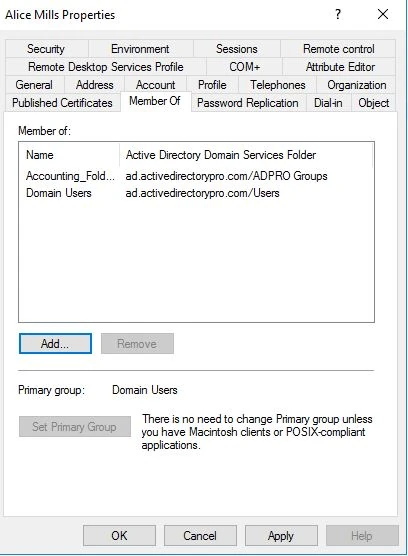
Image provided by [Active Directory Pro](https://activedirectorypro.com/wp-content/uploads/2021/01/add-user-ad-group-8.jpg) 

## Create a user account
### 1. Create New User Account
1. Right-click the OU where you want to create the new user account, select new, and then click user.

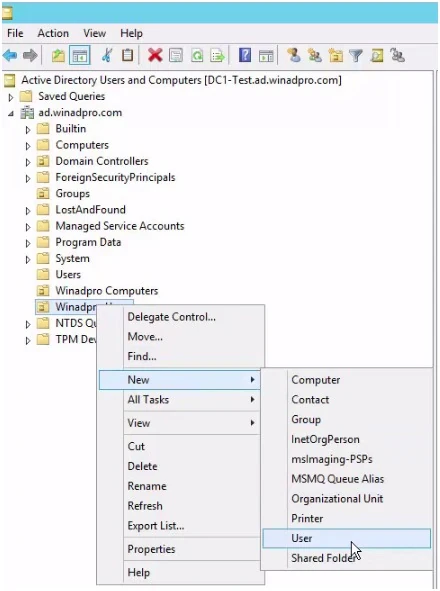
Image provided by [Active Directory Pro](https://activedirectorypro.com/wp-content/uploads/2016/10/101616_1329_HowtoCreate1.jpg) 

### 2. Enter User Account Details
1. Fill out the following details for the user account.
    1. First name
    2. Last name
    3. Initials (Optional)
    4. Full name (This will fill in automatically.)
    5. User logon name
2. Below is an example of the account details filled out.

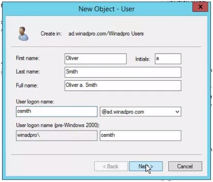
Image provided by [Active Directory Pro](https://activedirectorypro.com/wp-content/uploads/2016/10/101616_1329_HowtoCreate2.jpg) 

### 3. Enter User Password
1. Enter a new password and enter it again to confirm it. 
2. It’s recommended to select “User must change password at next logon”. This will force users to change their password the first time they log on.
3. What you make the password depends on your company’s security policy.
4. Forcing users to create their own passwords is more secure and the best practice.

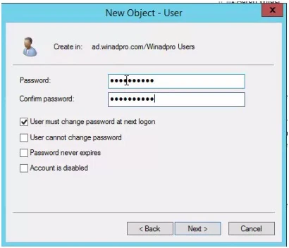
Image provided by [Active Directory Pro](https://activedirectorypro.com/wp-content/uploads/2016/10/101616_1329_HowtoCreate3.jpg) 

## Resources
- [How to Reset User Password in Active Directory (3 Easy Steps) - Active Directory Pro](https://activedirectorypro.com/how-to-reset-active-directory-password/) 
- [How to Add Users to Active Directory Groups - Active Directory Pro](https://activedirectorypro.com/add-users-to-active-directory-groups/) 
- [How to Create a New Active Directory User Account - Active Directory Pro](https://activedirectorypro.com/how-to-create-a-new-active-directory-user-account/) 

### Special Thanks
Thanks to [Active Directory Pro](https://activedirectorypro.com/) for providing the screenshots and instructions to perform common tasks with Active Directory.

### Inspiration
- [How we use Active Directory at work | Real world | Best Practice and tips -  East Charmer](https://youtu.be/Yb__4XttW7g?si=wIOiPu1EUFVs0sst) 